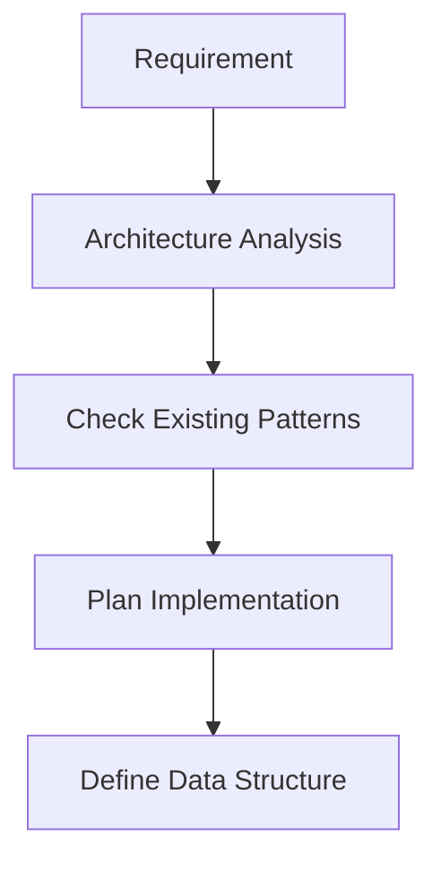
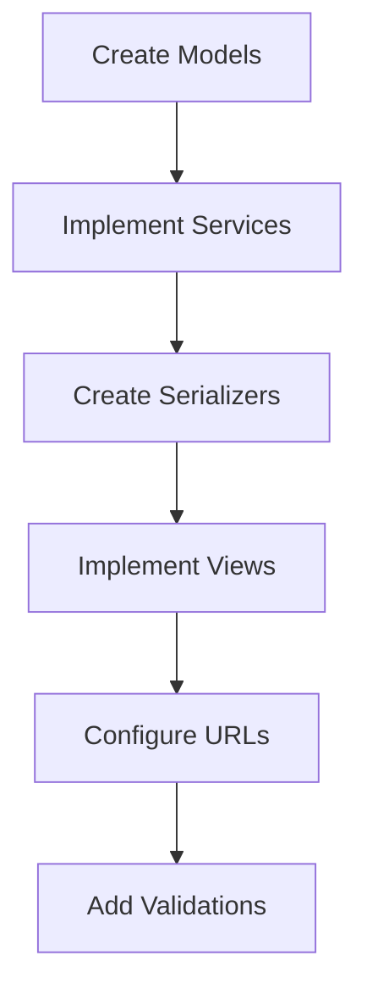
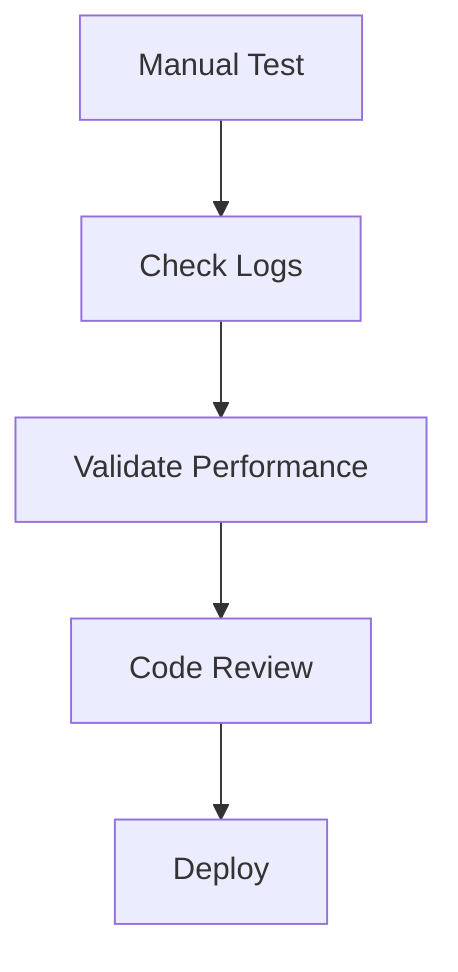

# Backend Development Rules - Jobs Manager

## 🚨 WARNING: AUTOMATED TESTS NOT YET REQUIRED 🚨

> **IMPORTANT:** Currently, we are **NOT** defining or requiring automated tests (unit, integration, API, etc.) as a mandatory part of this project. This documentation serves as a reference for architecture, quality, and process standards, but the current priority is **functionality, delivery, and manual validation**.

**When the codebase stabilizes, automated testing rules will be defined and documented here.**

---

## 🚨 MANDATORY DEFENSIVE PHILOSOPHY 🚨

This project follows a **strict defensive philosophy**:

- **FAIL EARLY, NO FALLBACKS** - Fail early and explicitly
- **MANDATORY ERROR PERSISTENCE** - ALL errors must be persisted in the database
- **NO SILENT FAILURES** - NEVER swallow exceptions or use silent fallbacks
- **MODERN ARCHITECTURE ONLY** - Only use modern CostSet/CostLine architecture

## Overview

This set of rules defines the mandatory standards for backend development in the Jobs Manager project. All rules are based on the existing architecture and best practices identified in the current codebase.

### Core Technologies

- **Django 5.x** with Django REST Framework
- **MariaDB** as the main database
- **UUID** as primary keys in all models
- **SimpleHistory** for mandatory auditing
- **Xero integration** for financial sync

## Rules Structure

### 📋 Full Index

| #   | File                                                                         | Description                                | Status |
| --- | ---------------------------------------------------------------------------- | ------------------------------------------ | ------ |
| 01  | [`01-architecture-design-patterns.md`](./01-architecture-design-patterns.md) | Mandatory architecture and design patterns | ✅     |
| 02  | [`02-code-organization-structure.md`](./02-code-organization-structure.md)   | Code organization and directory structure  | ✅     |
| 03  | [`03-api-design-standards.md`](./03-api-design-standards.md)                 | RESTful API design standards               | ✅     |
| 04  | [`04-data-handling-persistence.md`](./04-data-handling-persistence.md)       | Data handling and persistence              | ✅     |
| 05  | [`05-error-management-logging.md`](./05-error-management-logging.md)         | Error management and logging               | ✅     |
| 06  | [`06-testing-quality-assurance.md`](./06-testing-quality-assurance.md)       | Testing and quality assurance              | ✅     |
| 07  | [`07-security-performance.md`](./07-security-performance.md)                 | Security and performance optimization      | ✅     |
| 14  | [`08-good-practices.md`](./08-good-practices.md)                             | Good practices (SOLID, Clean Code, etc.)   | ✅     |

## Critical Rules (MANDATORY)

### 🚨 Database Architecture

```python
Job → CostSet (1:many) → CostLine (1:many)
CostLine → external references via ext_refs JSON field
CostLine → entry metadata via meta JSON field
CostLine → accounting_date for KPI reporting
Staff → CostLine (time entries via meta.staff_id)
```

### 🚨 Mandatory Error Persistence

```python
# ALWAYS use in ALL except blocks
from apps.workflow.services.error_persistence import persist_app_error

try:
    # Risky operation
    result = risky_operation()
except Exception as e:
    # MANDATORY: Persist error
    persist_app_error(e, request=request, context={'job_id': job_id})
    # MANDATORY: Re-raise - NEVER swallow
    raise
```

### 🚨 Mandatory Model Patterns

```python
import uuid
from django.db import models
from simple_history.models import HistoricalRecords

class BaseModel(models.Model):
    """Mandatory base model."""
    id = models.UUIDField(primary_key=True, default=uuid.uuid4, editable=False)
    created_at = models.DateTimeField(auto_now_add=True)
    updated_at = models.DateTimeField(auto_now=True)

    class Meta:
        abstract = True

class YourModel(BaseModel):
    # Mandatory auditing in critical models
    history = HistoricalRecords()

    def save(self, *args, **kwargs):
        # Mandatory validation
        self.full_clean()
        super().save(*args, **kwargs)
```

## Implementation Guides

### For New Developers

1. **Read ALL rules** before you start coding
2. **Set up your environment** following [`02-code-organization-structure.md`](./02-code-organization-structure.md)
3. **Understand the architecture** in [`01-architecture-design-patterns.md`](./01-architecture-design-patterns.md)
4. **Implement defensively** following [`05-error-management-logging.md`](./05-error-management-logging.md)

### For Existing Features

1. **Analyze existing code** to understand patterns
2. **Use only modern architecture** (CostSet/CostLine)
3. **Maintain compatibility** with legacy data via migrations
4. **Manually test** all changes

### For New Features

1. **Plan the architecture** following Service/Repository patterns
2. **Implement with UUID** as primary key
3. **Add auditing** with SimpleHistory
4. **Persist ALL errors** in the database
5. **Optimize queries** from the start

## Development Flow

### 1. Analysis and Planning



### 2. Implementation



### 3. Validation



## Development Checklist

### ✅ Before Starting

- [ ] Read all development rules
- [ ] Understood CostSet/CostLine architecture
- [ ] Set up development environment
- [ ] Have access to development database

### ✅ During Development

- [ ] Using only modern architecture (CostSet/CostLine)
- [ ] All models inherit from BaseModel
- [ ] UUID as primary key
- [ ] SimpleHistory in critical models
- [ ] Persisting ALL errors with persist_app_error()
- [ ] Strict validation at all entry points
- [ ] Structured logging implemented

### ✅ Before Commit

- [ ] Code formatted with Black
- [ ] Linting with Flake8 without errors
- [ ] Imports organized with isort
- [ ] Functionality manually tested
- [ ] Error scenarios tested
- [ ] Acceptable performance
- [ ] Logs checked

### ✅ Before Deploy

- [ ] Code review approved
- [ ] Migrations tested in staging
- [ ] Production backup performed
- [ ] Rollback scripts prepared
- [ ] Monitoring configured

## Essential Code Patterns

### Service Layer Pattern

```python
# apps/job/services/job_service.py
class JobService:
    @staticmethod
    def create_job(job_data: dict, user, request=None) -> Job:
        try:
            # Strict validation
            if not job_data.get('name'):
                raise ValidationError("Name is required")

            # Business logic
            job = Job.objects.create(...)
            return job

        except Exception as e:
            persist_app_error(e, request=request)
            raise
```

### Repository Pattern

```python
# apps/job/repositories/job_repository.py
class JobRepository:
    @staticmethod
    def get_active_jobs_with_costs() -> List[Job]:
        return Job.objects.active_jobs().with_client_and_costs()
```

### Error Handling Pattern

```python
# ALWAYS follow this pattern
try:
    result = risky_operation()

    # Strict validation
    if not result or not result.get('success'):
        raise ValueError(f"Invalid result: {result}")

    return result

except Exception as e:
    # MANDATORY: Persist error
    persist_app_error(e, request=request, context=context)
    # MANDATORY: Re-raise
    raise
```

## Resources and Tools

### Development Tools

- **Black** - Code formatting
- **Flake8** - Linting
- **isort** - Import organization
- **Bandit** - Security checking

### Useful Commands

```bash
# Formatting and linting
black apps/
flake8 apps/
isort apps/

# Migrations
python manage.py makemigrations
python manage.py migrate

# Tests (when implemented)
python manage.py test
```

### Log Structure

```python
# Structured logging configuration
logger.info(
    "Operation completed successfully",
    extra={
        'operation': 'create_job',
        'user_id': user.id,
        'job_id': job.id,
        'execution_time': execution_time,
        'status': 'success'
    }
)
```

## Troubleshooting

### Common Issues

1. **UUID error** - Check if model inherits from BaseModel
2. **Validation error** - Check if full_clean() is called
3. **Error not persisted** - Check if persist_app_error() is used
4. **Slow performance** - Check query optimization

### Where to Get Help

1. **Rules documentation** - This directory
2. **Existing code** - Examples in apps/job/services/
3. **Error logs** - Error dashboard in admin
4. **Architecture** - docs/architecture.md

## Contribution

### Updating the Rules

1. Identify the need for change
2. Discuss with the team
3. Update relevant documentation
4. Maintain consistency between rules
5. Update this README if necessary

### Adding New Rules

1. Follow the numbering pattern (08-, 09-, etc.)
2. Use a structure similar to existing files
3. Include practical examples
4. Add cross-references
5. Update the index in this README

## Version History

| Version | Date    | Changes                           |
| ------- | ------- | --------------------------------- |
| 1.0.0   | 2025-08 | Initial version with 7 main rules |

---

**⚠️ IMPORTANT**: These rules are **MANDATORY** and must be strictly followed. Any deviation must be justified and approved by the technical team.

## Related References

- See: [08-good-practices.md](./08-good-practices.md)
