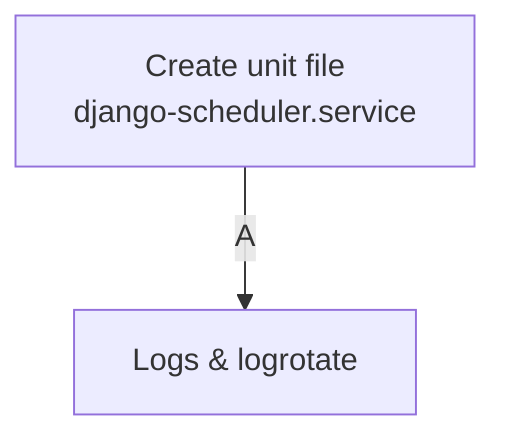

## Quick guide – Running **APScheduler** as a systemd daemon



### 1 · Create the unit file

`/etc/systemd/system/django‑scheduler.service`

```ini
[Unit]
Description=Django APScheduler
After=network.target

[Service]
Type=simple
User=django # replace with the system user that owns the venv/project
Group=django
WorkingDirectory=/srv/myproject
Environment=DJANGO_SETTINGS_MODULE=myproject.settings
Environment=DJANGO_RUN_SCHEDULER=1
ExecStart=/srv/venv/bin/python manage.py run_scheduler
Restart=always
RestartSec=5
StandardOutput=append:/var/log/django/scheduler.log
StandardError=append:/var/log/django/scheduler.log

[Install]
WantedBy=multi-user.target
```

### 2 · Log rotation

`/etc/logrotate.d/django_scheduler`

```
/var/log/django/scheduler.log {
    weekly
    rotate 8
    compress
    delaycompress
    missingok
    notifempty
    copytruncate
}
```

### 3 · Enable and start the service

```bash
sudo systemctl daemon-reload
sudo systemctl enable django-scheduler.service
sudo systemctl start  django-scheduler.service
sudo systemctl status django-scheduler.service
```

**Smoke test**

1. `journalctl -u django-scheduler -f` should show “APScheduler started”.
2. After a few minutes you ought to see the Xero heartbeat log lines flowing.
3. Restart Gunicorn – the scheduler log keeps ticking along, proving it’s isolated from the web workers.
