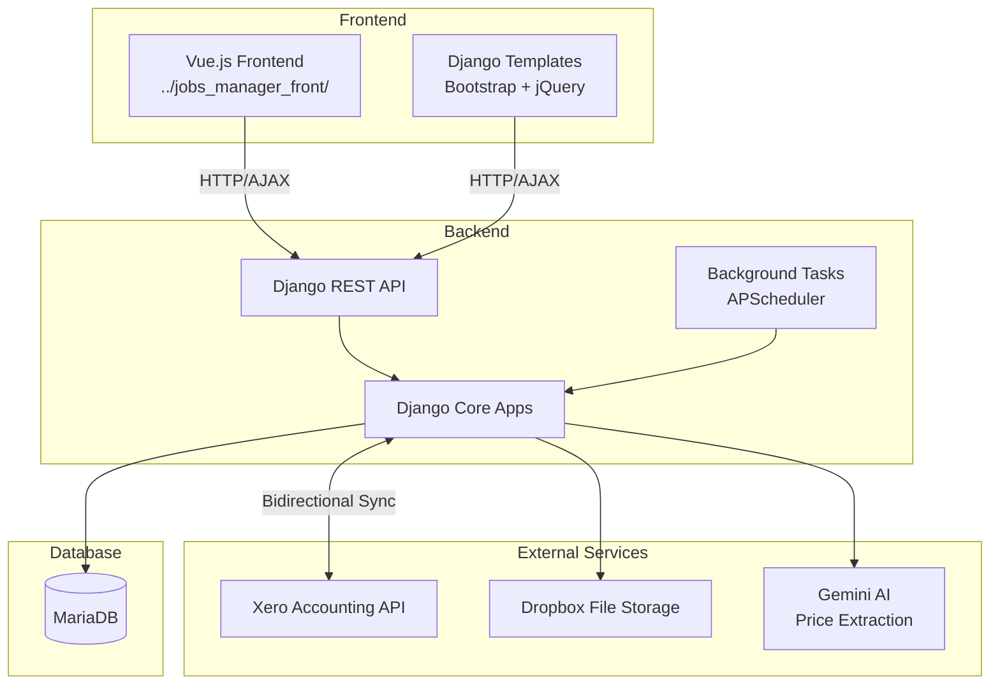
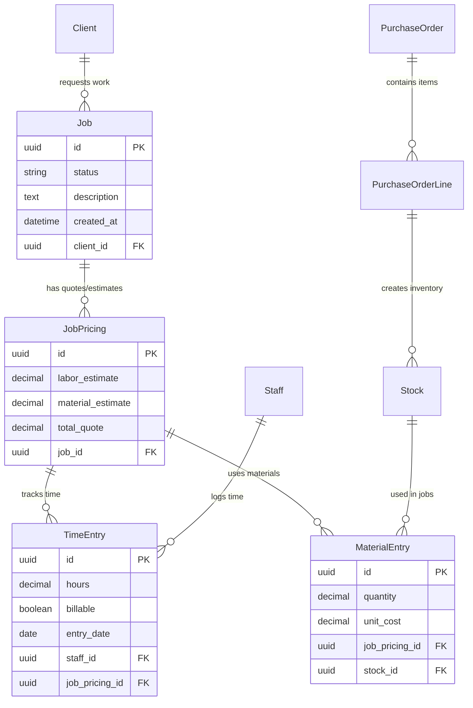
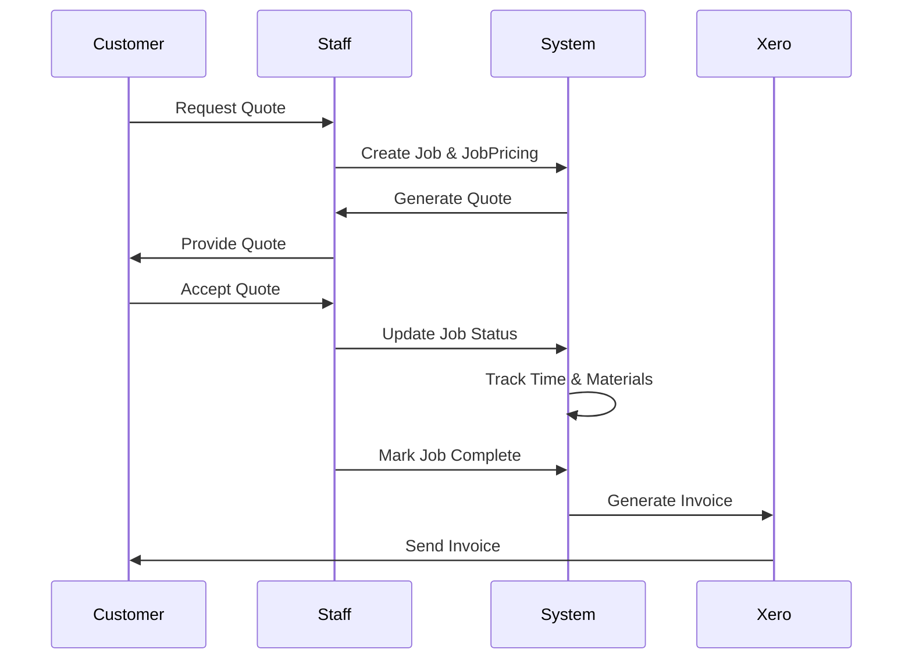

# Architecture Documentation

## System Overview

Morris Sheetmetal Works Job Management System is a Django-based web application that digitizes a 50+ year paper-based workflow from quote generation to job completion and invoicing for a custom metal fabrication business.

## High-Level Architecture



## Django Apps Architecture

### Core Application Structure

The system is organized into focused Django apps, each handling specific business domains:

#### **`workflow`** - Central Hub
- **Purpose**: Base functionality and integration coordination
- **Key Models**: CompanyDefaults, XeroAccount, XeroToken, AIProvider
- **Responsibilities**:
  - Xero accounting integration and synchronization
  - Authentication middleware and base templates
  - URL routing coordination
  - System-wide configuration

#### **`job`** - Job Lifecycle Management
- **Purpose**: Core business workflow from quote to completion
- **Key Models**: Job, JobPricing, JobFile, JobEvent, MaterialEntry, AdjustmentEntry
- **Responsibilities**:
  - Kanban-style status tracking (Quoting → In Progress → Completed → Archived)
  - Quote generation with revision tracking
  - Document attachment management
  - Comprehensive audit trails
  - Job costing and material tracking

#### **`accounts`** - User Management
- **Purpose**: Custom authentication and user management
- **Key Models**: Staff (extends AbstractBaseUser)
- **Responsibilities**:
  - Business-specific user requirements
  - Password strength validation (minimum 10 characters)
  - Role-based permissions and authentication

#### **`client`** - (Minimal) Customer Relationship Management
- **Purpose**: Customer data and (future) contact management
- **Key Models**: Client
- **Responsibilities**:
  - Bidirectional Xero contact synchronization
  - Contact person and communication history
  - Customer-specific job history

#### **`timesheet`** - Time Tracking and Billing
- **Purpose**: Labor time tracking and job costing
- **Key Models**: TimeEntry
- **Responsibilities**:
  - Time tracking linked to JobPricing for accurate costing
  - Billable vs non-billable classification
  - Daily/weekly timesheet interfaces
  - Wage rate and charge-out rate management

#### **`purchasing`** - Purchase Order and Inventory
- **Purpose**: Material procurement and inventory management
- **Key Models**: PurchaseOrder, PurchaseOrderLine, Stock
- **Responsibilities**:
  - Purchase order management with Xero integration
  - Stock management with source tracking
  - Supplier quote processing and delivery receipts
  - Material cost tracking to jobs

#### **`accounting`** - Financial Reporting
- **Purpose**: Financial analytics and KPI tracking
- **Key Models**: Various reporting models
- **Responsibilities**:
  - KPI calendar views and financial analytics
  - Invoice generation via Xero integration
  - Profitability analysis

#### **`quoting`** - Quote Generation and Pricing
- **Purpose**: Supplier pricing and quote management
- **Key Models**: Supplier pricing models
- **Responsibilities**:
  - Supplier price list management
  - AI-powered price extraction (Gemini integration)
  - Web scraping for pricing updates

## Data Model Relationships

### Core Entity Relationships



### Design Patterns

- **UUID Primary Keys**: Throughout system for security and distributed sync
- **SimpleHistory**: Audit trails on critical models (Job, JobPricing, etc.)
- **Soft Deletes**: Where appropriate to maintain referential integrity
- **Bidirectional Sync**: Xero integration with conflict resolution
- **Defensive Programming**: Fail early, trust data model, no silent failures

## Frontend Architecture

### Current Django Frontend
- **Bootstrap 5.3.3**: Responsive UI framework
- **jQuery 3.7.1**: DOM manipulation and AJAX
- **ag-Grid Community 33.0.2**: Advanced data tables
- **FullCalendar 6.1.17**: Scheduling interfaces
- **Quill 2.0.3**: Rich text editing
- **Chart.js 4.4.9 & Highcharts 12.0.2**: Data visualization

### Future Vue.js Frontend
Located in `../jobs_manager_front/`:
- **Vue 3**: TypeScript and Composition API
- **Vite**: Build tooling and development server
- **Vue Router**: Client-side routing
- **Pinia**: State management
- **Tailwind CSS**: Utility-first styling with shadcn/vue components
- **Axios**: API communication with Django backend

## API Architecture

### REST API Design
- **URL Patterns**: Consistent RESTful conventions
- **Authentication**: JWT token support with session fallback
- **Serialization**: Django REST Framework serializers
- **Permissions**: Role-based access control
- **Error Handling**: Standardized error responses

### Key API Endpoints
```
/api/jobs/                 - Job CRUD operations
/api/clients/              - Client management
/api/timesheets/           - Time entry operations
/api/purchasing/           - Purchase order management
/api/xero/                 - Xero integration endpoints
/api/reports/              - Financial reporting
```

## Integration Architecture

### Xero Integration
- **Purpose**: Bidirectional accounting synchronization
- **Data Flow**: Contacts, Invoices, Purchase Orders
- **Authentication**: OAuth 2.0 with token refresh
- **Sync Strategy**: Background tasks with conflict resolution
- **Error Handling**: Retry logic and failure notifications

### Dropbox Integration
- **Purpose**: File storage for job documents
- **Usage**: Job sheet attachments, drawings, documentation
- **Access Pattern**: Direct upload/download using the dropbox client for actual sync

### Gemini AI Integration
- **Purpose**: Price list extraction and processing
- **Usage**: Automated supplier pricing updates
- **Data Processing**: PDF parsing and structured data extraction

## Security Architecture

### Authentication & Authorization
- **Custom User Model**: Staff extends AbstractBaseUser
- **Password Policy**: Minimum 10 characters with strength validation
- **Session Management**: Django sessions with JWT support
- **Permission System**: Role-based with granular controls

### Data Protection
- **Environment Variables**: All sensitive credentials externalized
- **CSRF Protection**: Enabled with API exemptions where needed
- **File Upload Validation**: Restricted file types and sizes
- **Token Encryption**: Xero tokens encrypted at rest

## Performance Considerations

### Database Optimization
- **Indexes**: UUID fields frequently queried
- **Query Optimization**: Select_related and prefetch_related usage
- **Connection Pooling**: Configured for production loads

### Frontend Performance
- **AJAX Patterns**: Minimize full page reloads
- **ag-Grid**: Efficient handling of large datasets
- **Lazy Loading**: Components loaded as needed
- **Caching**: Strategic use of browser and server-side caching

### Background Processing
- **APScheduler**: Background task scheduling
- **Xero Sync**: Asynchronous data synchronization
- **File Processing**: Non-blocking file operations

## Deployment Architecture

### Environment Configuration
- **Settings Structure**: Modular settings (base/local/production_like)
- **Environment Variables**: Database, API keys, feature flags
- **Static Files**: Collected and served appropriately

### Required Services
- **Database**: MariaDB with appropriate sizing
- **Cache**: Redis for session storage and caching
- **Background Tasks**: Celery for production environments
- **File Storage**: Local or cloud-based (Dropbox integration)

## Business Process Integration

### Workflow Mapping
1. **Quote Generation**: Fast phone-based quoting system
2. **Job Creation**: Convert quotes to jobs with status tracking
3. **Production Management**: Kanban board workflow
4. **Time Tracking**: Daily time entry with job allocation
5. **Material Management**: Track usage and costs
6. **Completion & Invoicing**: Xero integration for billing

### Data Flow


## Future Architecture Considerations

Note - this is autogenerated and not really the plan.

### Scalability
- **Microservices**: Potential extraction of Xero integration
- **API-First**: Complete separation of frontend and backend
- **Caching Strategy**: Redis implementation for frequently accessed data

### Extensibility
- **Plugin Architecture**: Modular integration points
- **API Versioning**: Support for multiple frontend versions
- **Event System**: Decoupled notification and automation

This architecture supports the current business needs while providing a foundation for future growth and modernization efforts.
