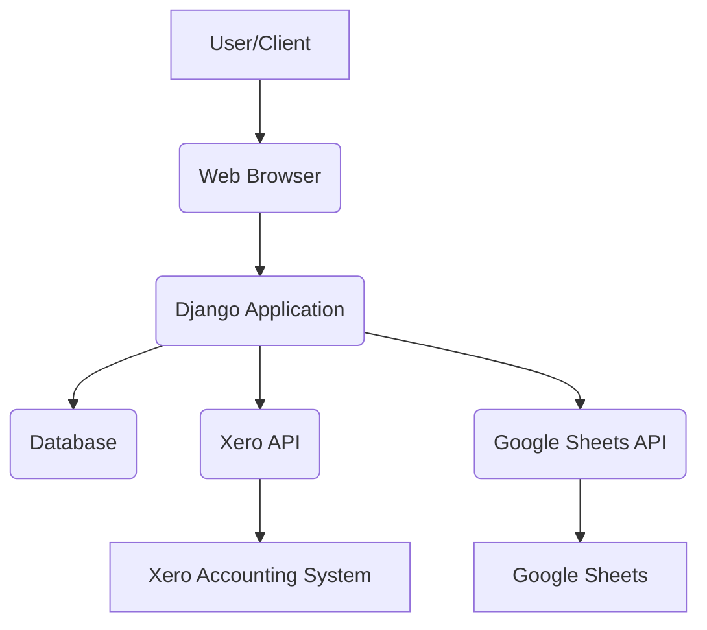

# Architecture Overview

This document provides a high-level overview of the `jobs_manager` project's architecture.

## Key Components

*   **Django Web Application:** The core of the system, handling web requests, business logic, and data persistence.
*   **Database (MySQL):** Stores all application data, including jobs, clients, timesheets, and other related information.
*   **Xero Integration:** Handles synchronization with Xero for accounting purposes (invoices, contacts, etc.).
*   **Google Sheets Integration:** Used for specific reporting or data exchange functionalities.
*   **Static Files:** CSS, JavaScript, and images served by Django.

## Data Flow (Conceptual)

## Modules and Their Responsibilities

*   `job/`: Manages job-related entities and logic.
*   `timesheet/`: Handles time entry and timesheet management.
*   `workflow/`: Contains core application logic, models, views, and services.
    *   `workflow/api/`: API endpoints and related logic.
    *   `workflow/models/`: Database models.
    *   `workflow/services/`: Business logic and integrations.
*   `accounts/`: User authentication and authorization.
*   `scripts/`: Utility scripts for various tasks (e.g., data anonymization, database backups).